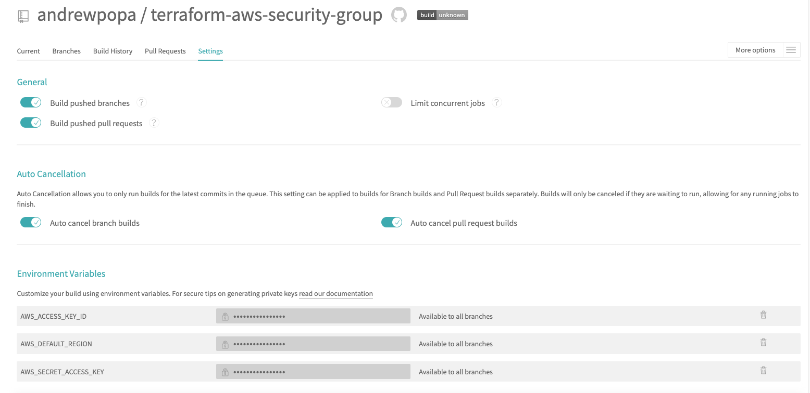

# terraform-aws-security-group
Terraform module to create security-group resource on AWS

| **Branch**  | **Build status** |
| ------------- | ------------- |
| master  | [](https://travis-ci.org/andrewpopa/terraform-aws-security-group)  |

# Terraform version
This module was written and tested with Terraform v0.12.9 

# Assumptions
- You want to create security-group which will be attached to VPC and can be consumed by other resources inside VPC
- You have access to AWS console where you can create you security credentials `AWS_ACCESS_KEY_ID` and `AWS_SECRET_ACCESS_KEY`
- You configured your security credentials as your environment variables `~/.bash_profile` 

```
export AWS_ACCESS_KEY_ID=XXXX
export AWS_SECRET_ACCESS_KEY=XXXX
export AWS_DEFAULT_REGION=XXXX
```

# How to consume
- [`example`](https://github.com/andrewpopa/terraform-aws-security-group/tree/master/example) folder contain an example of how to consume the module

```
module "vpc" {
  source = "github.com/andrewpopa/terraform-aws-vpc"
  cidr_block = "172.16.0.0/16"
  vpc_subnets = ["172.16.10.0/24", "172.16.11.0/24", "172.16.12.0/24"] 
  vpc_tags = {
    vpc         = "my-aws-vpc"
    subnet      = "subnet"
    internet_gw = "my-internet-gateway"
  }
}

module "security-group" {
  source = "github.com/andrewpopa/terraform-aws-security-group"
  
  # Security group
  security_group_name       = "my-aws-security-group"
  security_group_description = "my-aws-security-group-descr"
  ingress_ports             = [22, 443, 8800, 5432]

  tf_vpc = module.vpc.vpc_id
}

```

# Inputs
| **Name**  | **Type** | **Default** | **Required** | **Description** |
| ------------- | ------------- | ------------- | ------------- | ------------- |
| security_group_name | string | tf-aws-security-group | no | SG name |
| security_group_description | string | tf-security-group-description | no | SG description |
| ingress_ports | list | [0] | no | List of ingress ports |
| sg_tags["security_group"] | map | allow-traffic | no | Map for sg tags | 
| tf_vpc | string | default | yes | VPC where security group will be created |

# Outputs
| **Name**  | **Type** | **Description** |
| ------------- | ------------- | ------------- |
| sg_id | string | Security group ID |
| ingress_ports | list | List of ports accessible via ALB |

# Testing
Module has implemented testing with [kitchen](https://kitchen.ci/) and [kitchen-terraform](https://newcontext-oss.github.io/kitchen-terraform/)

## Install locally

run in cli
```
echo 'export PATH="$HOME/.rbenv/bin:$PATH"' >> ~/.bash_profile
source ~/.bash_profile
rbenv init
echo 'eval "$(rbenv init -)"' >> ~/.bash_profile
source ~/.bash_profile
```

use 2.3.1 version 

```
rbenv install 2.3.1
rbenv local 2.3.1
```

check current version
```
rbenv version
```

output
```
2.3.1 (set by /Users/user/.ruby-version)
```

make sure you have you bundler installed `bundler version` with similar output

```
Bundler version 2.0.2 (2019-06-13 commit 496bca538)
```

or install it 

```
gem install bundler
```

install all required gems specified in `Gemfile`

```
bundle install
```

test the module

```
bundle exec kitchen converge
bundle exec kitchen verify
bundle exec kitchen destroy
```

## Remote
For remote testing [travis](https://travis-ci.org) is used with the same steps as local testing

- install dependencies via bundle install with `Gemfile`
- download and unzip terraform version 0.12.9
- terraform init
- execute kitchen test

### Assumptions
- You are logged in travis with your github account.
- Travis has access to you repository
- You have configured Environment variables for travis

